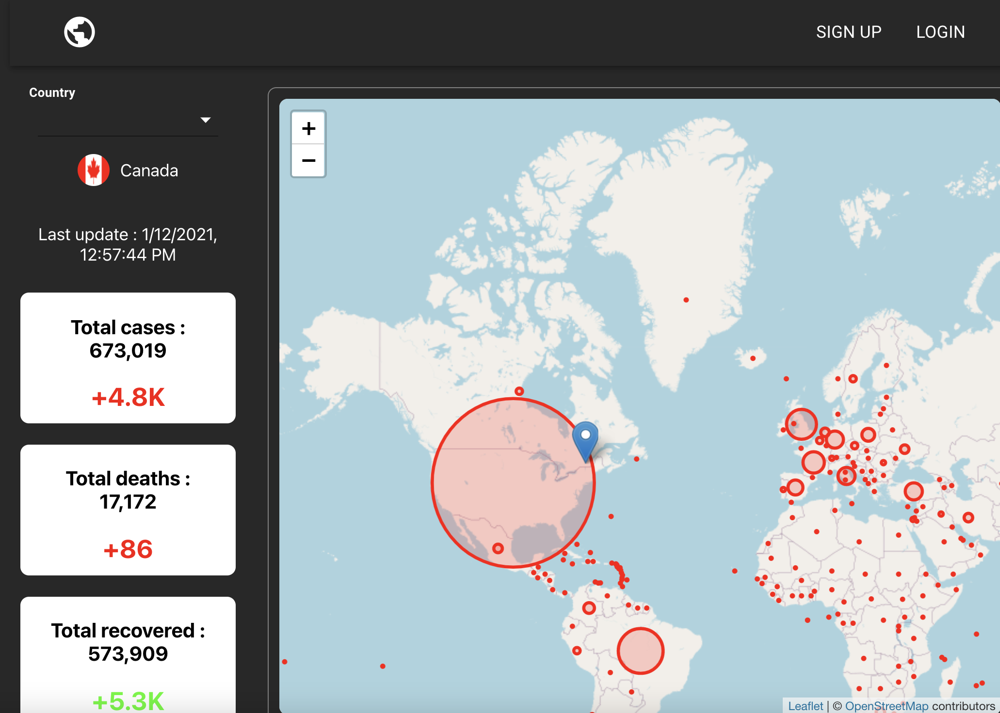
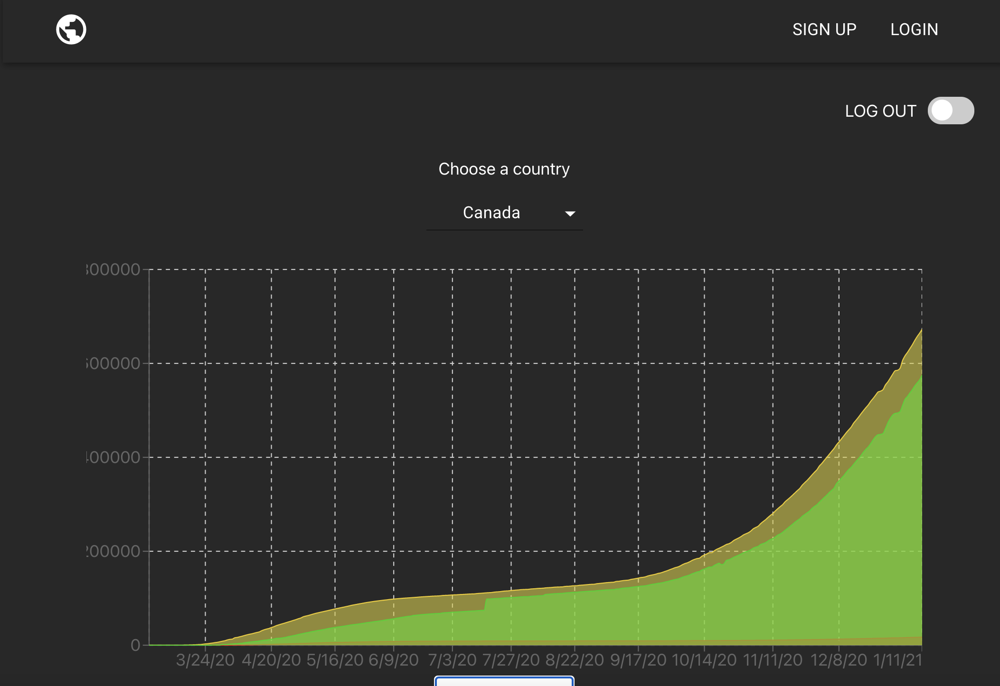

# Covid Tracker App

A web application created with React.

# Description

This web app gives you the ability to track worldwide numbers related to the COVID situation (cases, deaths, recovered).

You can also create your own account in order to have access to an area chart and have a detailed evolution for a specific country.

# Technologies

- React
- Node
- Express
- Firebase / Cloud Firestore

## Available Scripts

In the project directory, you can run:

### `yarn start`

Change directory to `covid-app`.

Runs the app in the development mode.\
Open [http://localhost:3000](http://localhost:3000) to view it in the browser.

### `yarn dev`

Launches the server in the `backend` directory.
